<div align="center">

# ⚡ PowerPulse 

**IoT-Based Energy Monitoring & Visualization Platform for Multifunction Meters**    

[](https://aws.amazon.com/iot-core/)
[](https://aws.amazon.com/dynamodb/)
[](https://aws.amazon.com/bedrock/)
[](https://nodejs.org/)
[](https://mqtt.org/)
[](https://modbus.org/)

[](https://odicon.soa.ac.in/)
[](https://pesmodern.edu.in/)
[](https://sdgs.un.org/goals/goal7)


> Real-time dual-source energy monitoring, AI-powered audit reports, and automated alerting — deployed live on campus infrastructure via AWS.

🎥 **[Watch Demo](#-demo)** · 📸 **[Screenshots](#-dashboard--screenshots)** · ☁️ **[Architecture](#-cloud-architecture)** · 📄 **[Publication](#-research-publication)**

</div>

---

> **⚠️ Deployment Note:** PowerPulse was fully deployed on AWS EC2 and ran live at AISSMS IOIT, Pune — monitoring real Secure Elite multifunction energy meters. The EC2 instance is currently stopped due to infrastructure costs. All features shown here were production-tested and are documented with screenshots and a demo video below.

---

## What It Does

Most institutional campuses run two power sources — a utility grid and a diesel generator for backup — with no real-time visibility into either. Manual tracking misses anomalies, can't log source switches, and provides nothing useful for energy audits.

PowerPulse connects both meters to a cloud-native dashboard that gives operations teams:

- **Live three-phase readings** from both grid and DG, simultaneously, segregated by source
- **Historical trend analysis** with custom date ranges and per-parameter filtering
- **Automated Power Quality Audit Reports** — generated by AI, downloadable as PDF
- **Real-time anomaly alerts** via AWS SNS (email + SMS)
- **Natural language queries** against live energy data via an AI chatbot

---

## System Architecture

```
  Secure Elite 440 ─┐
  (Grid / MSEDCL)   │  RS-485 Modbus RTU     ┌─────────────────┐     MQTT/TLS
                    ├─────────────────────── ▶│ Teltonika TRB245│──────────────▶ AWS IoT Core
  Secure Elite 300 ─┘  9600 bps, daisy-chain  │ IoT Gateway     │
  (Diesel Generator)                           └─────────────────┘
                                                                          │
                                    ┌─────────────────────────────────────┤
                                    │         AWS Cloud                   │
                              Rules Engine                                │
                              ┌─────┴──────┐                              │
                         DynamoDB       Lambda ──▶ SNS (Email/SMS alerts) │
                              └─────┬──────┘                              │
                                    │                                     │
                              Node.js/Express (EC2)                       │
                              REST API + WebSocket                        │
                                    │                                     │
                              Amazon Bedrock ◀───────────────────────────┘
                              (AI Analysis)
                                    │
                              S3 + CloudFront + Route53
                                    │
                              ┌─────▼──────────────────┐
                              │   Web Dashboard         │
                              │   Chart.js · HTML/CSS   │
                              │   Grid  │  Generator    │
                              └─────────────────────────┘
```

---

## Hardware

| Device | Role | Protocol |
|---|---|---|
| **Secure Elite 440** | Monitors MSEDCL (grid) supply — 3-phase, THD, energy | RS-485 Modbus RTU |
| **Secure Elite 300** | Monitors Diesel Generator supply | RS-485 Modbus RTU |
| **Teltonika TRB245** | Industrial IoT gateway — Modbus master, MQTT publisher, LTE/4G | MQTT over TLS |

Both meters measure: **Voltage (R/Y/B phases) · Current · Active Power · Reactive Power · Apparent Power · Power Factor · Frequency · THD (up to 31st harmonic) · Energy (kWh)**

---

## Cloud Architecture

| AWS Service | Purpose |
|---|---|
| **IoT Core** | MQTT broker — ingests TRB245 data, runs Rules Engine routing |
| **DynamoDB** | Time-series NoSQL storage, segregated by `server_id` (Grid=1, DG=2) |
| **Lambda** | Serverless anomaly detection — triggers SNS alerts on threshold breach |
| **SNS** | Real-time email and SMS alerts to subscribed users |
| **EC2** | Hosts Node.js + Express.js backend and WebSocket server |
| **Amazon Bedrock** | AI inference — Claude Haiku, LLaMA for chatbot and audit reports |
| **S3 + CloudFront** | Frontend hosting with global CDN |
| **Route 53** | DNS and domain routing |
| **SES** | Transactional email for automated report distribution |

---

## Features

### Real-Time Dual-Source Monitoring
Live WebSocket feed from both Grid and DG simultaneously. Data is fully segregated by `server_id` from gateway all the way through to the dashboard — the two sources never mix at any layer.

### Role-Based Access
Two access tiers — **Admin** (full control including SNS management, manual alerts, register config) and **Viewer** (read-only dashboard and reports).

### Historical Data & Logs
Custom date-range data tables with dynamic column selection per parameter. Includes **downtime incident logs** and **source-switching logs** (timestamped Grid ↔ DG transitions).

### Advanced Reports
Automated Power Analysis Reports with voltage trends, current analysis, power factor, frequency, and Grid vs. DG comparative charts. Downloadable as **PDF** via html2pdf.js.

### AI-Powered Analysis *(Amazon Bedrock)*
- **AI Chatbot** — query live energy data in natural language: *"What was today's peak consumption?"*, *"Show voltage anomalies in the last 24h"*
- **AI Audit Report Generator** — automated Power Quality Audit with system health indicators, anomaly detection, efficiency recommendations, and issue identification
- Models used: **Claude Haiku, LLaMA, ChatGPT** via Bedrock API

### Automated Alerting *(AWS Lambda + SNS)*
Anomaly detection runs serverless on every incoming IoT packet. Detected conditions (overvoltage, high current, power fluctuations, communication failure) trigger instant SNS push to all subscribed emails and phone numbers. Admins can also broadcast manual alerts from the dashboard.

### Historic Trends
Long-range trend plots for any electrical parameter across any custom date window.

---

## Dashboard — Screenshots

> All screenshots are from the live system running on campus infrastructure.

### Access & Live Monitoring

| Admin View | Viewer View |
|:---:|:---:|
| 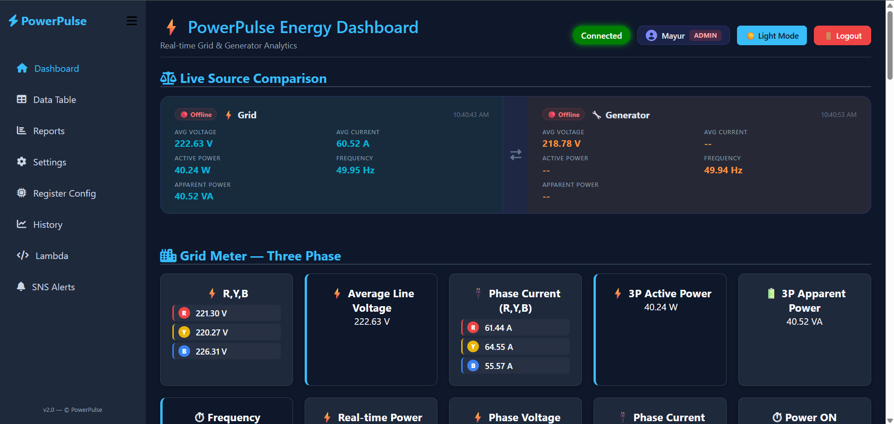 | 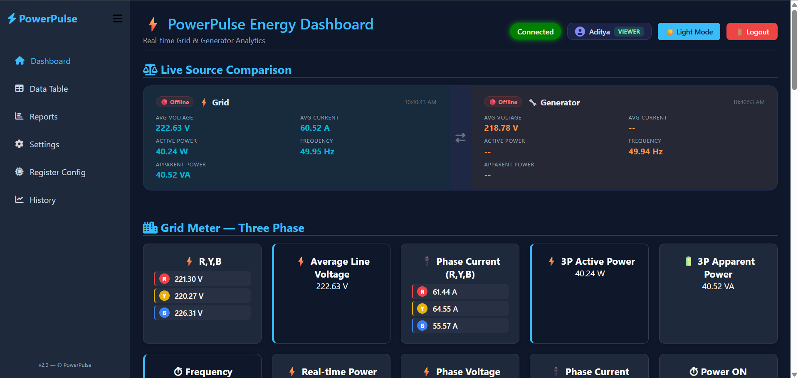 |

| Grid Active | DG Active |
|:---:|:---:|
|  |  |

**Simultaneous Grid + DG Live Monitoring**
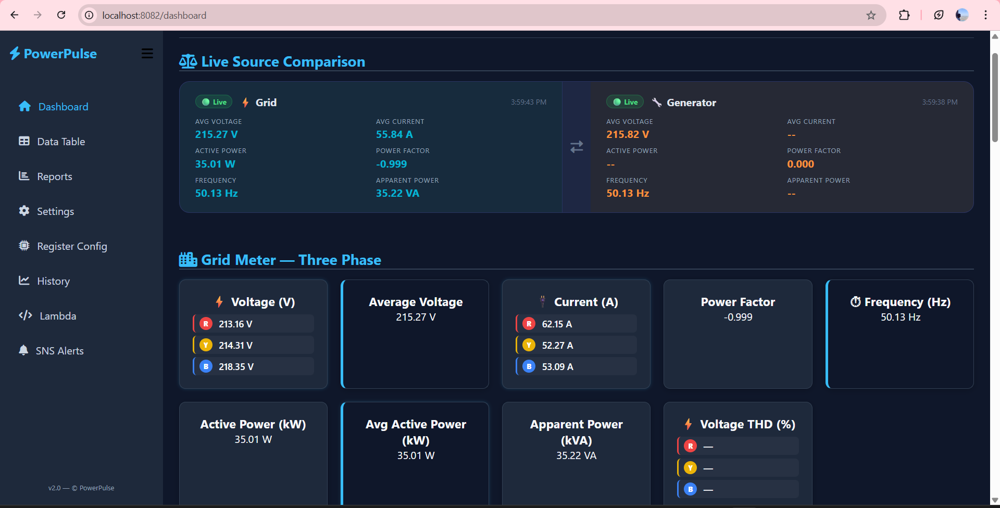

---

### Data Storage & Historical Tables

| Grid Historical Data | Generator Historical Data |
|:---:|:---:|
|  | 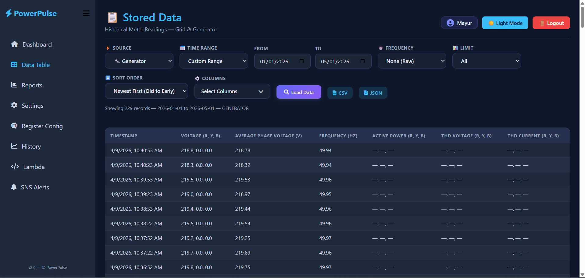 |


*Dynamic column selection — choose exactly which parameters to display*

---

### Report Generation

| Date Range Selection | Power Analysis Overview |
|:---:|:---:|
| 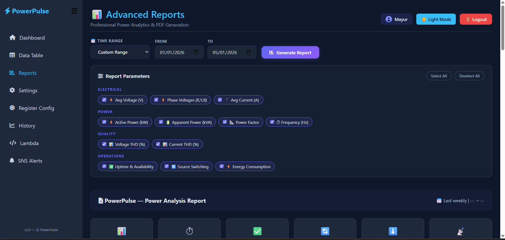 | 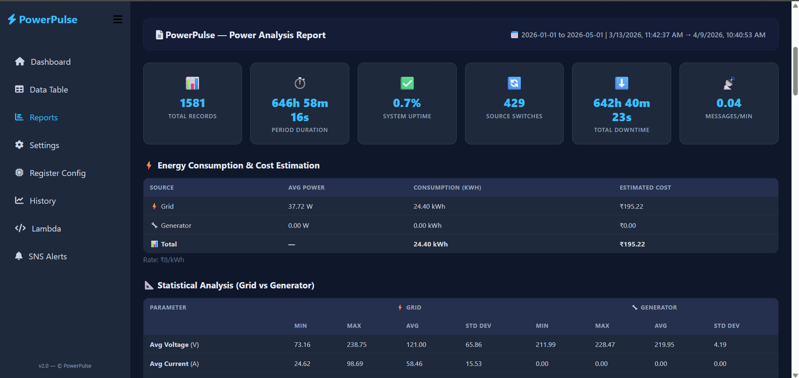 |

| Voltage & Current Monitoring | Power Factor & Frequency Trends |
|:---:|:---:|
| 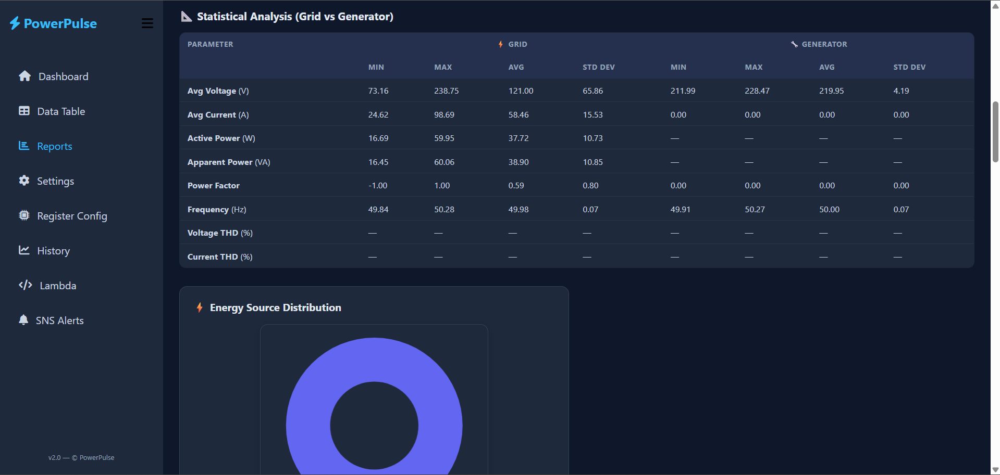 | 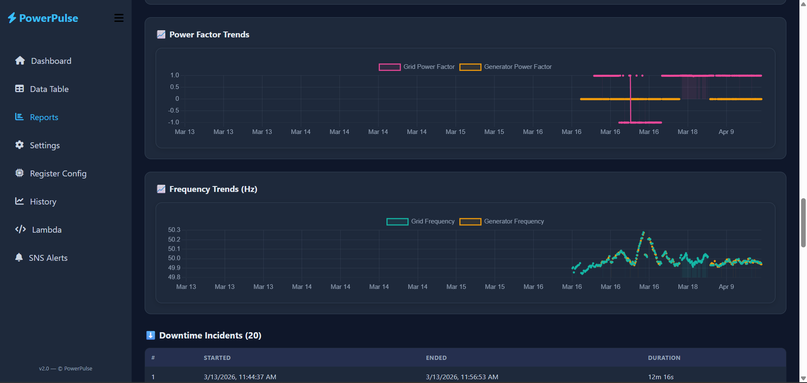 |

---

### AI Analysis

| AI Report Interface | AI Power Quality Summary |
|:---:|:---:|
| 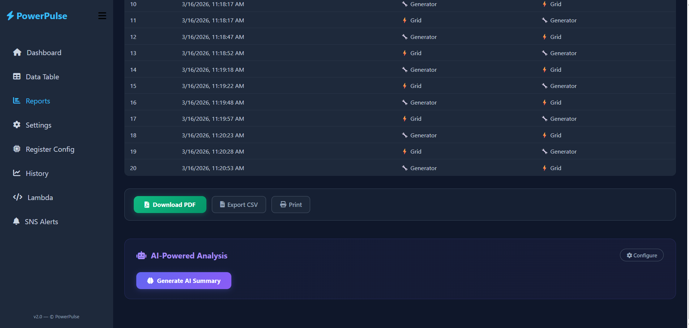 | 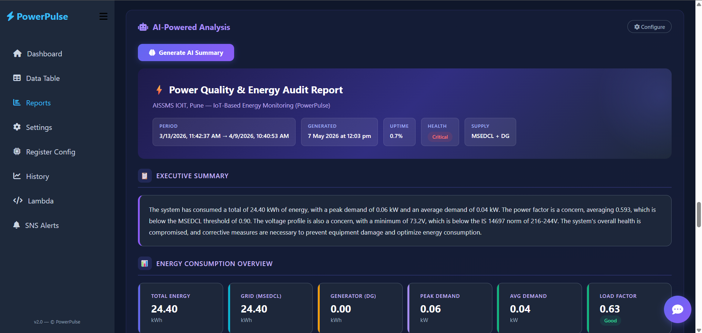 |

| AI Recommendations | Detailed AI Insights |
|:---:|:---:|
| 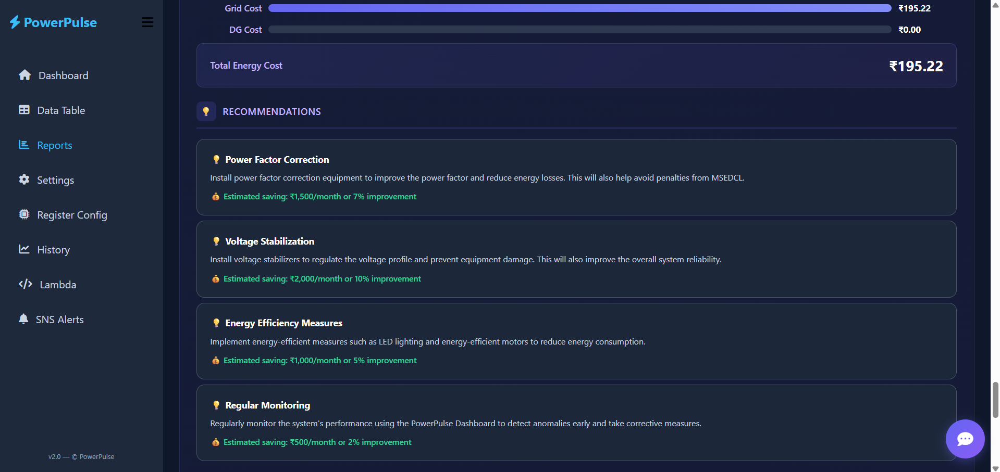 | 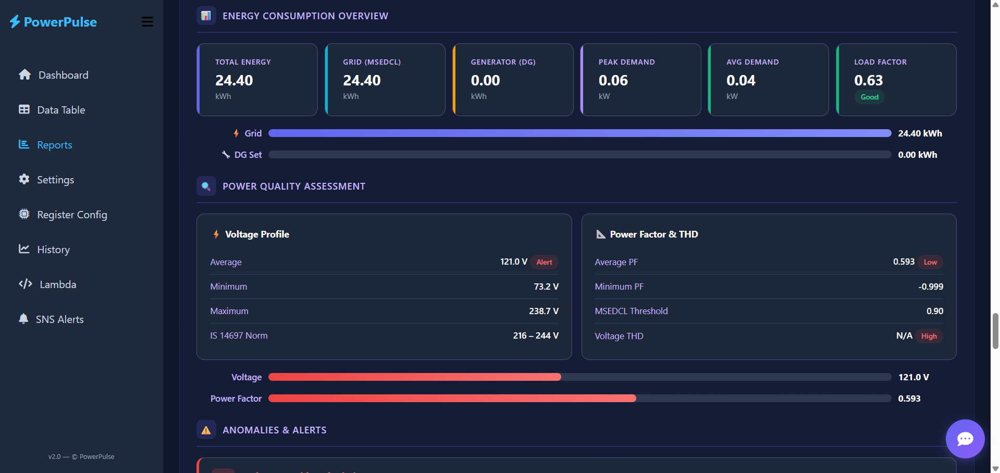 |

**Final AI Report — System Health & Conclusion**
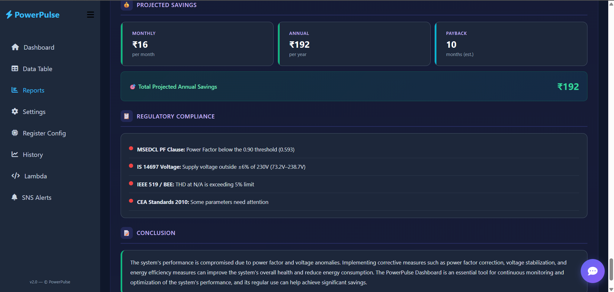

---

### Historic Trends

| Trends Dashboard | Frequency, PF & Phase Voltage |
|:---:|:---:|
| 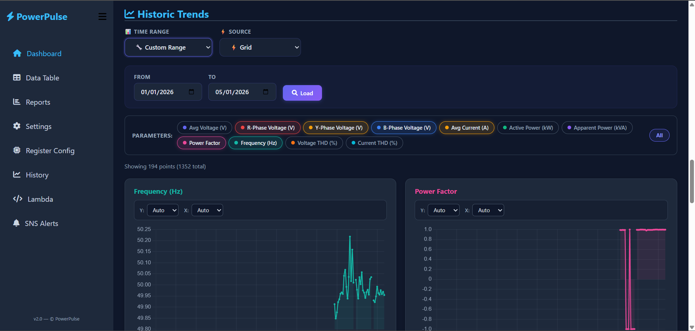 | 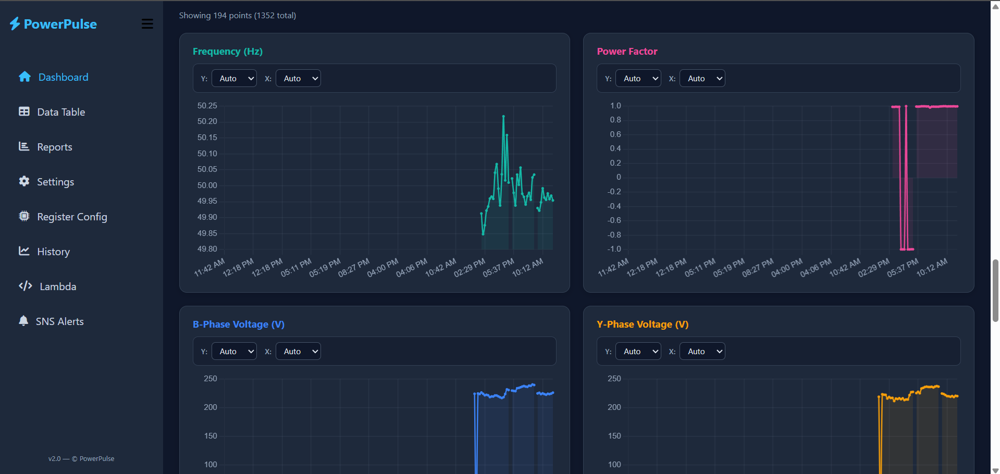 |

---

### Downtime, Source Switching & SNS Alerts

| Downtime Log | Source Switching Log |
|:---:|:---:|
| 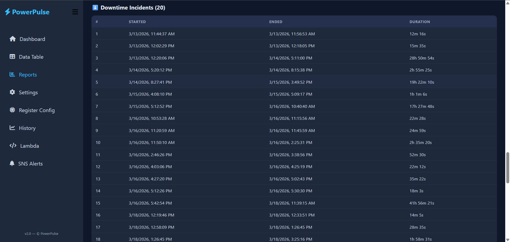 | 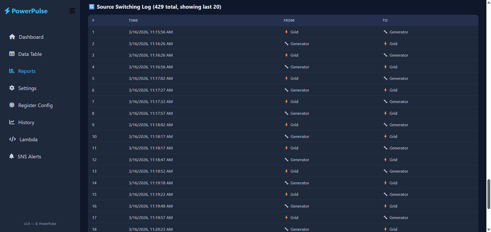 |

| SNS Management | Confirmed Subscriptions | Email Alert |
|:---:|:---:|:---:|
| 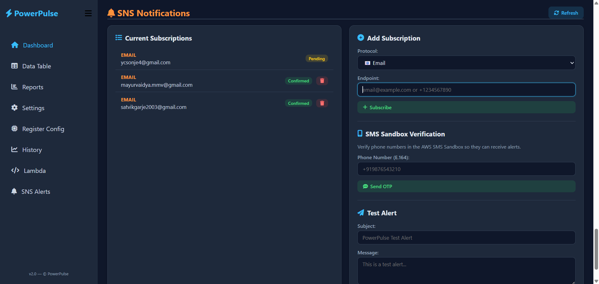 | 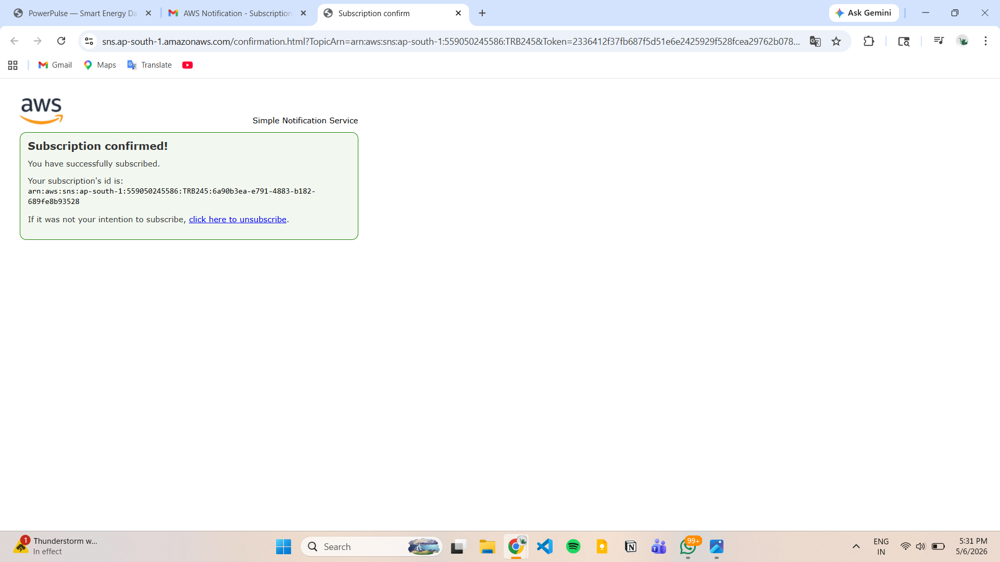 | 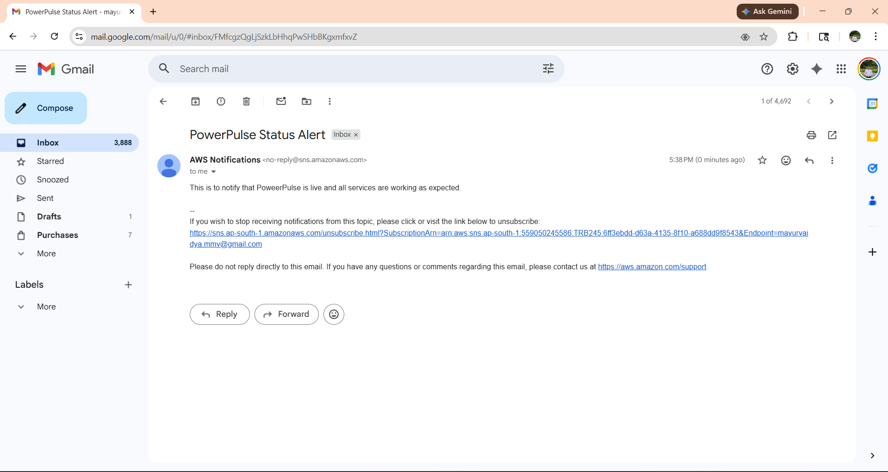 |

---

## 🎥 Demo

> 📹 **[Watch Full System Demo](./assets/demo.mp4)**

## 🎥 Demo

<video src="https://github.com/mayurvaidya-mmv/PowerPulse/releases#release-demo-video" controls width="100%"></video>

> Covers: live RS-485 → AWS data flow · source switching · AI chatbot · audit report generation · SNS alert delivery · PDF export


---

## Performance

| Metric | Result |
|---|---|
| Average end-to-end latency | ~0.8 seconds |
| Maximum observed latency | ~1.3 seconds |
| Packet loss | Zero |
| Voltage measurement stability | Stable under continuous operation |
| Data accuracy | ±1% (meter accuracy class) |

---

## Research Publication

> **"Design and Implementation of IoT Based Energy Monitoring System for Smart Energy Meters"**

Presented at **ODICON-2026** — 4th Odisha International Conference on Electrical Power Engineering, Communication and Computing Technology
Organized by Institute of Technical Education & Research, Siksha 'O' Anusandhan Deemed University, Bhubaneswar · **20–21 February 2026**

Supported by: IEEE Bhubaneswar Section · IEEE Power Electronics Society · IEEE Power & Energy Society · Anusandhan National Research Foundation (ANRF)

---

## Awards

🏆 **Consolation Prize** — M-Pulse 2026 Project Competition, PES Modern College of Engineering

---

## SDG Alignment

Contributes to **SDG 7** (Affordable & Clean Energy) · **SDG 9** (Industry & Innovation) · **SDG 11** (Sustainable Cities) · **SDG 13** (Climate Action)

---

*B.Tech Electrical Engineering Final Year Project — AISSMS Institute of Information Technology, Pune · Academic Year 2025–26*


<!-- Deployment -->


<!-- Cloud Services & AI -->


<!-- Storage -->


<!-- Communication & Protocols -->


<!-- Frontend & Backend -->


<!-- Hardware -->


<!-- Recognition -->
[](https://odicon.soa.ac.in/)
[](https://pesmodern.edu.in/)
[](https://sdgs.un.org/goals/goal7)
